# Budapest - A Historical Travel Guide

This Website is a comprehensive travel guide designed to help tourists and history enthusiasts explore the fascinating historical sites, landmarks, and hidden gems of Budapest. Whether you're planning a trip or just curious about the city's history, this guide has you covered.

## Table of Content

- [User Experience UX](#user-experience)

  - [Wireframes](#wireframes)

  - [Site Structure](#site-structure)

  - [Design Choices](#design-choices)

  - [typography](#typograph)

  - [Color Scheme](#color-scheme)

- [Features](#features)

  - [Home](#home)

    - [Navigation Menu](#navigation-menu)
    
     - [Background Image](#bachground-image)

    - [Introduction](#introduction)

    - [Footer](#footer)
    
    - [Historical Places](#historical-places)
    
    - [Fun Places](#fun-places)
    
    - [Gallery](#gallery)
    
    - [Contact](#contact)

- [Technologies Used](#technologies-used):

  - [HTML5](#html5): provides the content and structure for the website.

- [CSS](#css): provide the styling.

- [Balssamiq](#balsamiq)

## User Experience UX

### Wireframes

The wireframes for Budapest - A Historical Travel Guide were produced in [Balsamiq]("https://balsamiq.cloud/"). There are frames for a full width display and a small mobile device. The final site varies slightly from the wireframes due to developments that occured during the creation process.

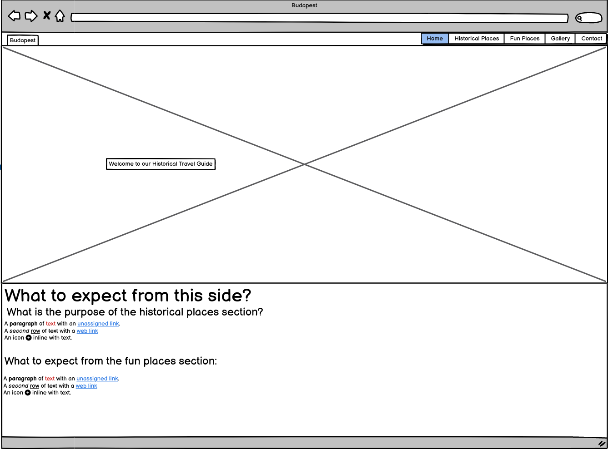

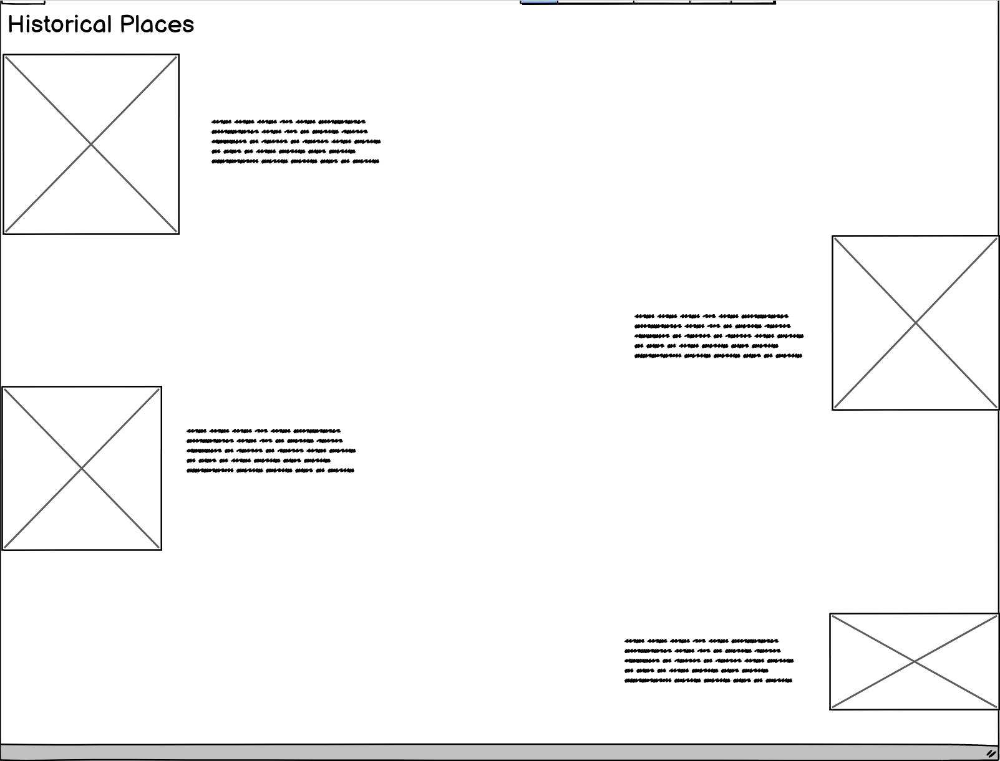

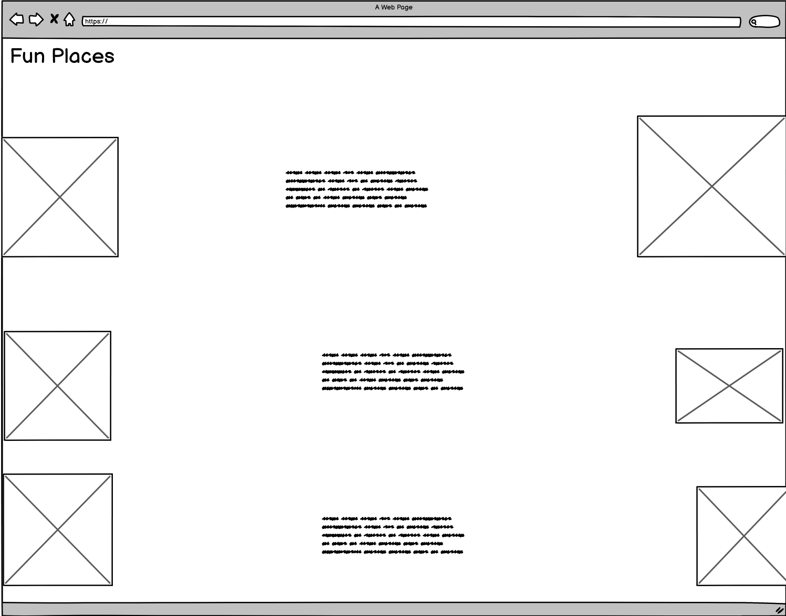

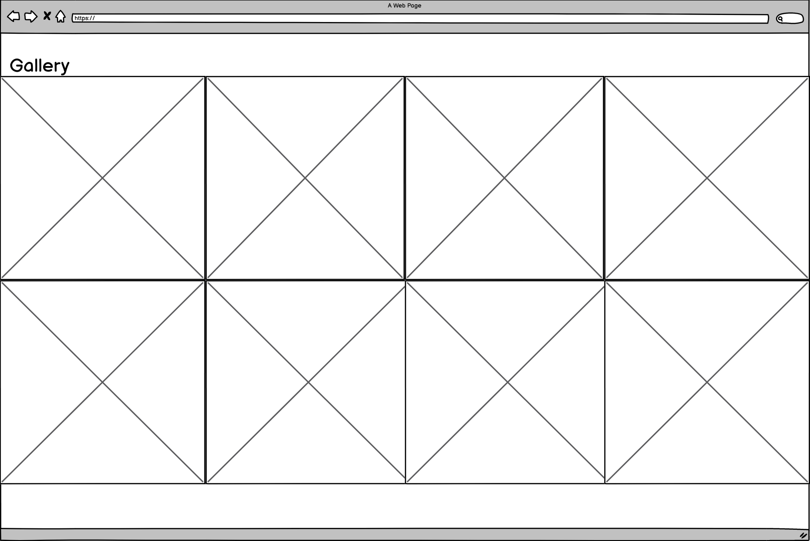

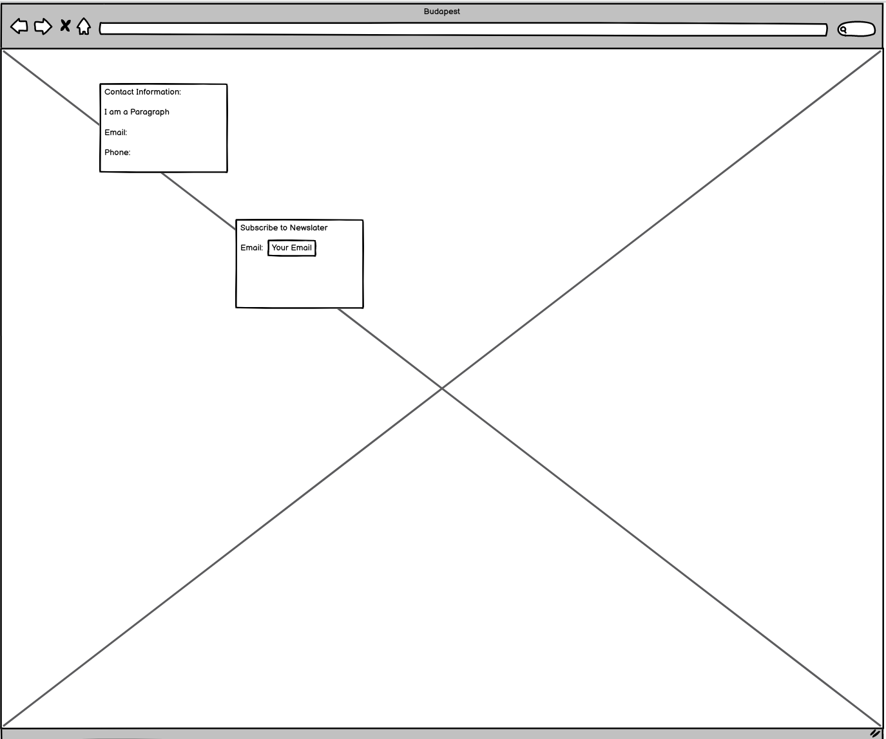

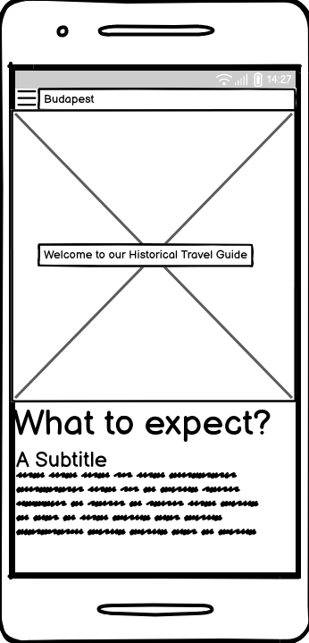

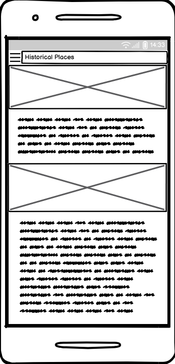

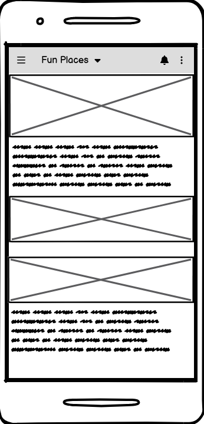

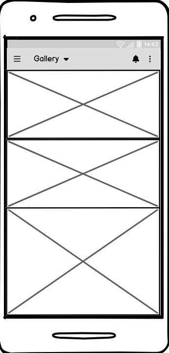

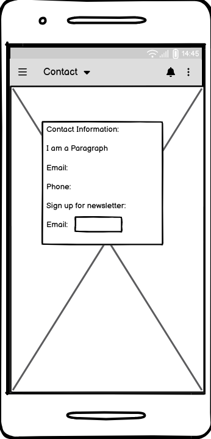

### Site Structure

Budapest - A Historical Travel Guide have five pages. The [Home](#home) page is the default loading page, [Historical Places](#historical-places), [Fun Places](#fun-places), [Gallery](#gallery) and [Contact](#contact) pages are all accessible primarily from the navigation menu.

### Design Choices

- [Typography](#typography)

I have choosen the font Lato for the Website because it is supposed to be a travel guide which provide mostly information about Budapest. I felt like other fonts could might be to distracting while reading the Text section on the page.
On the [Home](#home) the welcome Text which appears when the User Hover over the middle on a Laptop or Desktop is in italic to transmit a warm welcome feeling to the Page. The headings of the introduction Section underneth the Background image on the [Home](#home) are in italic to accentuate them from the Text sections below.

- Color Scheme

The color scheme choosen is one based on Monochromatic color Schemes, see blow in the screenshot.

### Features

The Website Budapest - A Historical Travel Guide got build to give users who visit the Website a Inspiration and historical insights about Budapest.

- Navigation Menu:

  - located at the top of the page, is fully responsive and contains all links to all pages of the site.

  - The logo os clickable and brings the user back to the Home page.

  

- [Home](#home):

Contains a background image of the Parliament with a hover effect in the middle of the Page. When the user hover on a Desktop or laptop over the middle of the image, a welcome Text appears. On mobile devices or tablet the text appears without the blue background on the center of the page.

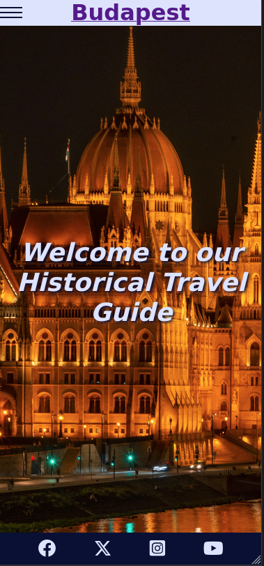

- Introduction to page:

below the background image there are two text blocks with two subheadings and one main heading to give the user an idea what to expect from this side.

- Footer: 

  - The Footer contains clickable social media links of the Travel Guide, which direct the user directly to the selected side in a new tap.

  - Once the users visited the social media sites of the Guide, they can access reviews, feedbacks and more informaion about the Guide and what it does.
  
  - The user can decide based on this information, if it would be worrthy to conect with the Travel Guide also on social media.

  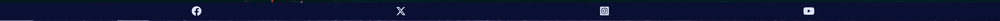

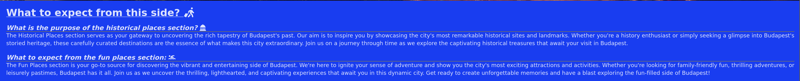

- [Historical Places](#historical-places):

The Historical Places page give the user a short summary about the historical background of some places in Budapest, it's purpose is only to give an Inspiration for places to visit.

- [Fun Places](#fun-places):

The Fun Places site want to give the user ideas about what to do in Budapest to have fun and enjoy themself.

- [Gallery](#galllery:)

The Gallery page was created to increase the desire of the user to visit Budapest with visualising the city with photos. 

- [Contact](#contact):

The Contact page is giving the user the possibility to contact the Travel Guide for further information and Sign up for an exclusive newsletter to stay updated about the latest historical insights.

- Confirmation Form: 

When users subscribe to the newsletter they get redirected to the confirmation page, with a background image of the Chainbridge and a green success message and a clickable [Home](#home) link, so the user can get back to the Homepage.
The green text color was choosen because it is comonly known as a positive signal color.

