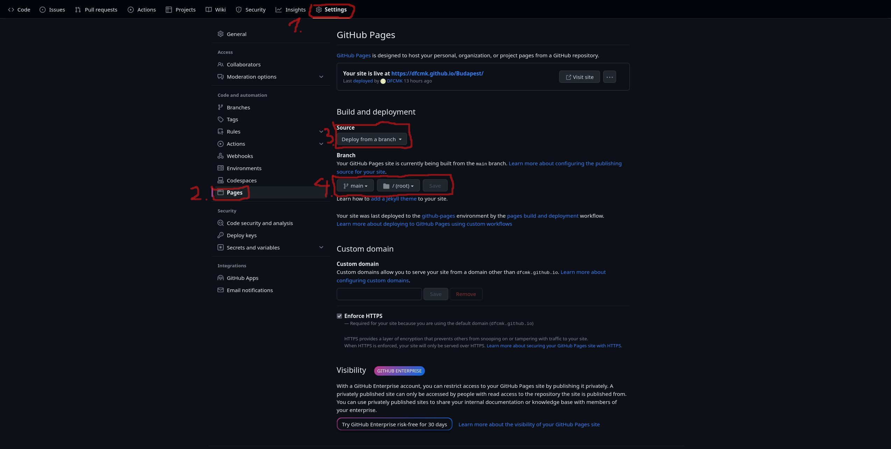
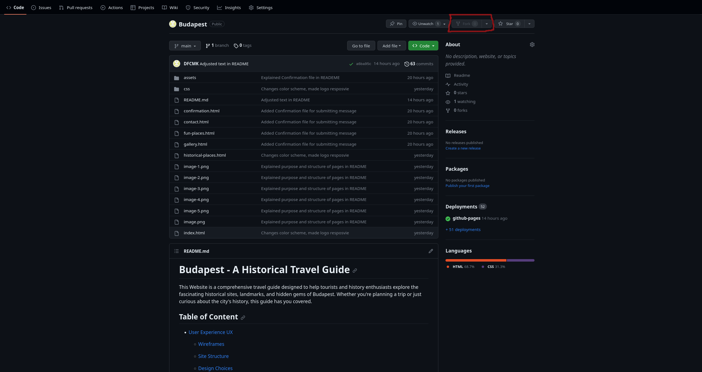
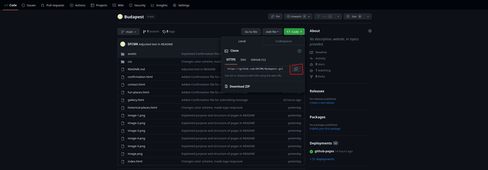

# Budapest - A Historical Travel Guide

This Website is a comprehensive travel guide designed to help tourists and history enthusiasts explore the fascinating historical sites, landmarks, and hidden gems of Budapest. Whether you're planning a trip or just curious about the city's history, this guide has you covered.

Are you ready to explore <a href="https://dfcmk.github.io/Budapest/">Budapest?</a>

## Table of Content

- [User Experience UX](#user-experience)

  - [Wireframes](#wireframes)

  - [Site Structure](#site-structure)

  - [Design Choices](#design-choices)

  - [typography](#typograph)

  - [Color Scheme](#color-scheme)

- [Features](#features)

  - [Home](#home)

    - [Navigation Menu](#navigation-menu)
    
     - [Background Image](#bachground-image)

    - [Introduction](#introduction)

    - [Footer](#footer)
    
    - [Historical Places](#historical-places)
    
    - [Fun Places](#fun-places)
    
    - [Gallery](#gallery)
    
    - [Contact](#contact)

- [Technologies Used](#technologies-used)

- [Testing](#testing)

- [Deployment](#deployment)

- [Credits](#credits)

  - [Content](#content)
  
  - [Media](#media)
  
  - [Code](#code)

## User Experience UX

### Wireframes

The wireframes for Budapest - A Historical Travel Guide were produced in [Balsamiq]("https://balsamiq.cloud/"). There are frames for a full width display and a small mobile device. The final site varies slightly from the wireframes due to developments that occured during the creation process.

### Site Structure

Budapest - A Historical Travel Guide have five pages. The [Home](#home) page is the default loading page, [Historical Places](#historical-places), [Fun Places](#fun-places), [Gallery](#gallery) and [Contact](#contact) pages are all accessible primarily from the navigation menu.

### Design Choices

- [Typography](#typography)

I have choosen the font Lato for the Website because it is supposed to be a travel guide which provide mostly information about Budapest. I felt like other fonts could might be to distracting while reading the Text section on the page.
On the [Home](#home) the welcome Text which appears when the User Hover over the middle on a Laptop or Desktop is in italic to transmit a warm welcome feeling to the Page. The headings of the introduction Section underneth the Background image on the [Home](#home) are in italic to accentuate them from the Text sections below.

- Color Scheme

The color scheme choosen is one based on Monochromatic color Schemes, see blow in the screenshot.

### Features

The Website Budapest - A Historical Travel Guide got build to give users who visit the Website a Inspiration and historical insights about Budapest.

- Navigation Menu:

  - located at the top of the page, is fully responsive and contains all links to all pages of the site.

  - The logo os clickable and brings the user back to the Home page.

  

- [Home](#home):

Contains a background image of the Parliament with a hover effect in the middle of the Page. When the user hover on a Desktop or laptop over the middle of the image, a welcome Text appears. On mobile devices or tablet the text appears without the blue background on the center of the page.

- Introduction to page:

below the background image there are two text blocks with two subheadings and one main heading to give the user an idea what to expect from this side.

- Footer: 

  - The Footer contains clickable social media links of the Travel Guide, which direct the user directly to the selected side in a new tap.

  - Once the users visited the social media sites of the Guide, they can access reviews, feedbacks and more informaion about the Guide and what it does.
  
  - The user can decide based on this information, if it would be worrthy to conect with the Travel Guide also on social media.

  

- [Historical Places](#historical-places):

The Historical Places page give the user a short summary about the historical background of some places in Budapest, it's purpose is only to give an Inspiration for places to visit.

- [Fun Places](#fun-places):

The Fun Places site want to give the user ideas about what to do in Budapest to have fun and enjoy themself.

- [Gallery](#galllery:)

The Gallery page was created to increase the desire of the user to visit Budapest with visualising the city with photos. 

- [Contact](#contact):

The Contact page is giving the user the possibility to contact the Travel Guide for further information and Sign up for an exclusive newsletter to stay updated about the latest historical insights.

- Confirmation Form: 

When users subscribe to the newsletter they get redirected to the confirmation page, with a background image of the Chainbridge and a green success message and a clickable [Home](#home) link, so the user can get back to the Homepage.
The green text color was choosen because it is comonly known as a positive signal color.

### Technologies Used

- [HTML5](#html5): provides the content and structure for the website

- [CSS](#css): provide the styling

- [Balssamiq](#balsamiq): used to create the wireframes

- [VS Code](vs-code): used to deploy the website.

### Testing

Please refer to <a href="https://github.com/DFCMK/Budapest/blob/main/TESTING.md"><em>here<em></a> for more information on testing Budapest - A Historical Travel Guide

### Deployment 

This site was depolyed to GitHub pages. The steps to deploy a site are shown below:

1. In the GitHub Repository called <b>Budapest</b> click on the <b>Settings</b> button on the Repoitory navigation menu.

2. In <b>Settings</b> on the left side, go down to the <b>Pages</b> item and click on it.

3. Make sure the <b>Source</b> item is set to: <b>Deploy from a branch</b>

4. at the <b>Branch</b> item underneth the <b>source</b> item, set the branch to main and save it.

5. Once you have selected the main branch, the page will automatically refresh to show a detailed ribbon display indicating that the deployment was successful. If the page does not refresh automatically, refresh it manually.

To get to the live link of the GitHub repository - click here: <a href="https://github.com/DFCMK/Budapest">https://github.com/DFCMK/Budapest</a>

#### To Fork the repository on GitHub

Forking a GitHub repository creates a copy of the repository in your own GitHub account. You can view and modify the copy without affecting the original repository.

To fork a repository:

1. Log in to GitHub and navigate to the repository you want to fork.
2. Click the Fork button in the top-right corner of the page.
3. Select a name for your forked repository.
4. Click the Fork button to create the copy.

Once you have forked a repository, you can clone it to your local computer and start making changes. When you are ready to share your changes, you can create a pull request to the original repository.

#### To create a local clone of this project:

1. Click the Code tab under the repository's name.
2. Click the clipboard icon in the Clone with HTTPS section to copy the URL.

Once you have copied the URL, you can use a Git client to clone the repository to your local computer.
Here are the steps to clone a repository using Git Bash:

3. Open Git Bash.
4. Navigate to the directory where you want to clone the repository.
5. Type the following command and press Enter:

git clone <URL>

Replace <URL> with the URL of the repository that you copied in step 2.

This will create a local clone of the repository in the current directory.

You also can create and name the directory where the clone should be saved in, with adding the directory name after the <URL>. So the full command would look like this: git clone <URl> XXXX(This is a directory name)

### Credits

  #### Content

   - The font came from <a href="https://fonts.google.com/">Google Fonts.</a>
   - The colour palate was compiled by  <a href="https://www.w3schools.com/colors/colors_monochromatic.asp">W3Schools</a>
   - The icons came from <a href="https://fontawesome.com/search?q=swi&o=r&m=free">Font Awesome</a>
   - The Navigation Menu got created with a <a href="https://www.youtube.com/watch?v=8QKOaTYvYUA">YouTube tutorial.</a>
   - The inspiration for the Project came during creation process.
   - <a href="https://balsamiq.cloud/s3wc28z/p2hs46j/r2278">Balsamiq</a> was used to create the wireframes.

   - The Gallery was build with code based on the <a href="https://github.com/DFCMK/Love-Running">Love Running</a>

   - The content of [Chainbridge](#chainbridge) on the [Historical Places](#historical-places) is mostly summarized from the book <b><q>Hungry History and Culture</q></b> chapter: <b><q>Reformation period</q></b> sub chapter: <b><q>Hitel written by Istvan Szechenyi 1830
</b> 

   - The rest of the content are summerised wikipedia articles, see below: 
   <a href="https://en.wikipedia.org/wiki/Hungarian_Parliament_Building">Hungarian Parliament</a>
   <a href="https://en.wikipedia.org/wiki/Buda_Castle">Buda Castle</a> 
   <a href="https://en.wikipedia.org/wiki/Matthias_Church">Matthias Church</a> 
   <a href="https://en.wikipedia.org/wiki/Szimpla_Kert">Szimpla Kert</a> 
   <a href="https://en.wikipedia.org/wiki/Gell%C3%A9rt_Baths">Gellert Bath</a>
   <a href="https://en.wikipedia.org/wiki/Sz%C3%A9chenyi_thermal_bath">Széchenyi Bath</a>
   <a href="https://en.wikipedia.org/wiki/Great_Market_Hall,_Budapest">The Great Market Hall</a>     

   #### Media

   - background image on Home page came from <a href="https://www.pexels.com/">pexels</a>

   - images on other pages came from <a href="https://www.pexels.com/">unspash</a> and <a href="https://www.istockphoto.com">istockphoto</a>

 

