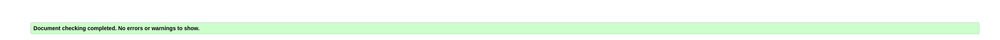

# Testing

## Code Validation

- The Budapest - A Historical Travel Guide website has been thoroughly tested. All of the code has been run through the W3C HTML Validator and the W3C CSS Validator. Minor errors were found on the home, Historical places, and Contact pages, as well as a warning on the Gallery page.

All of the errors have been fixed, except for the warning on the Gallery page. You can see the warning in the screenshot below.

Six minor errors were also found in the CSS stylesheets, which have all been fixed. You can see the errors in the screenshot below.

The HTML validator results for each page are below:

 - Home:

 

 - Historical Places:

 .png "HTML Validation report Historical places")

 - Fun places:

 .png "HTML Validation report fun places")

 - Gallery:

 .png "HTML Validation report Gallery")

 - Contact: 

 .png "HTML Validation report Contact page")

 - Confirmation: 

 .png "HTML Validation report Confirmaton page")

 - CSS stylesheet - CSS Validator result:

 

